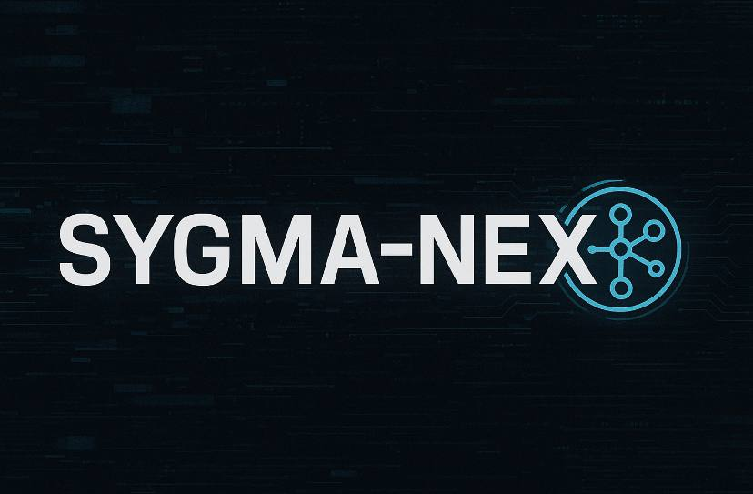

<div align="center">



# SIGMA-NEX
**Sistema di Intelligenza Artificiale Autonomo per la Sopravvivenza Offline-First**


</div>

Un agente cognitivo avanzato progettato per scenari critici, blackout e ambienti ostili

[Documentazione](docs/) | [Releases](https://github.com/SebastianMartinNS/SYGMA-NEX/releases) | [Issues](https://github.com/SebastianMartinNS/SYGMA-NEX/issues)

## Panoramica

SIGMA-NEX è un sistema di intelligenza artificiale completamente offline progettato per fornire supporto cognitivo avanzato in condizioni estreme. Utilizzando modelli di linguaggio locali attraverso Ollama, offre assistenza specializzata per la sopravvivenza, gestione del rischio e adattamento autonomo senza dipendere da infrastrutture cloud o connessioni internet.

> **Uso Globale**: SIGMA-NEX può essere usato da qualsiasi directory grazie al sistema di configurazione globale integrato!

### Caratteristiche Principali

| Funzionalità | Descrizione |
|:---|:---|
| **Completamente Offline** | Zero dipendenze da servizi cloud o internet |
| **Agente Cognitivo Avanzato** | Basato su modelli LLM locali (Ollama + Mistral) |
| **Orientato alla Sopravvivenza** | Specializzato in scenari critici e di emergenza |
| **Supporto Multilingue** | Traduzione integrata con MarianMT |
| **Interfacce Multiple** | CLI, GUI desktop e API REST |
| **Ricerca Semantica** | Recupero intelligente da knowledge base FAISS |
| **Sicurezza Integrata** | Crittografia, validazione input e controllo accessi |

### Architettura del Sistema

```
┌─────────────────────────────────────────────────────────────┐
│                    SIGMA-NEX Ecosystem                      │
├─────────────────────────────────────────────────────────────┤
│  ┌─────────────┐  ┌─────────────┐  ┌─────────────┐         │
│  │   CLI       │  │   GUI       │  │   API       │         │
│  │  Interface  │  │  Interface  │  │   Server    │         │
│  └─────────────┘  └─────────────┘  └─────────────┘         │
├─────────────────────────────────────────────────────────────┤
│  ┌─────────────────────────────────────────────────────┐   │
│  │              Core Engine                           │   │
│  │  ┌─────────┐  ┌─────────┐  ┌─────────┐  ┌─────────┐ │   │
│  │  │ Runner  │  │Context  │  │Retriever│  │Translate│ │   │
│  │  └─────────┘  └─────────┘  └─────────┘  └─────────┘ │   │
│  └─────────────────────────────────────────────────────┘   │
├─────────────────────────────────────────────────────────────┤
│  ┌─────────────────────────────────────────────────────┐   │
│  │              AI Models & Data                       │   │
│  │  ┌─────────┐  ┌─────────┐  ┌─────────┐               │   │
│  │  │ Ollama  │  │ FAISS   │  │MarianMT │               │   │
│  │  │(Mistral)│  │ Index   │  │Models   │               │   │
│  │  └─────────┘  └─────────┘  └─────────┘               │   │
│  └─────────────────────────────────────────────────────┘   │
└─────────────────────────────────────────────────────────────┘
```

## Installazione Rapida

### Prerequisiti di Sistema

- **Sistema Operativo**: Windows 10+, Linux (Ubuntu 20.04+), macOS 11+
- **Python**: 3.10 o superiore
- **RAM**: Minimo 8GB, raccomandati 16GB+
- **Spazio Disco**: 5GB per modelli e dati
- **Ollama**: [Installazione obbligatoria](https://ollama.com)

### Installazione Automatica (Raccomandata)

```bash
# 1. Clona il repository
git clone https://github.com/SebastianMartinNS/SYGMA-NEX.git
cd SYGMA-NEX

# 2. Esegui setup automatico (Windows)
.\venvesetup.bat

# Linux/Mac
chmod +x scripts/setup_dev.py
python scripts/setup_dev.py

# 3. Installa modelli Ollama richiesti
ollama pull mistral
```

### Installazione Manuale

```bash
# Crea ambiente virtuale
python -m venv venv

# Attiva ambiente virtuale
# Windows
venv\Scripts\activate
# Linux/Mac
source venv/bin/activate

# Installa dipendenze
pip install -r requirements.txt

# Installazione in modalità sviluppo
pip install -e .
```

### Verifica Installazione

```bash
# Test completo del sistema
sigma self-check

# Output atteso:
# Ollama is available
# Available models:
#   mistral:latest
```

### Configurazione Globale (Uso da Qualsiasi Directory)

Per utilizzare `sigma` da qualsiasi directory senza perdere il contesto:

**Opzione 1: Comando Automatico**
```bash
# Installa configurazione globale
sigma install-config

# Su Windows (automatico):
# - Copia i file in %USERPROFILE%\AppData\Roaming\sigma-nex
# - Imposta SIGMA_NEX_ROOT come variabile d'ambiente

# Su Linux/macOS (automatico):
# - Copia i file in ~/.config/sigma-nex
# - Aggiunge SIGMA_NEX_ROOT al profilo shell
```

**Opzione 2: Script Automatico**
```bash
# Windows
.\scripts\setup_global_windows.bat

# Linux/macOS
./scripts/setup_global_unix.sh
```

**Opzione 3: Manuale**
```bash
# Windows
set SIGMA_NEX_ROOT=C:\path\to\sigma-nex

# Linux/macOS
export SIGMA_NEX_ROOT=/path/to/sigma-nex
```

**Importante**: Dopo l'installazione globale, riavvia il terminale per rendere effettive le modifiche.

## Utilizzo

### Interfaccia a Riga di Comando (CLI)

SIGMA-NEX offre un'interfaccia CLI completa per tutte le operazioni:

```bash
# Avvia modalità interattiva REPL
sigma start

# Carica framework di conoscenza personalizzato
sigma load-framework data/Framework_SIGMA.json

# Verifica integrità del sistema
sigma self-check

# Analizza e migliora codice Python
sigma self-heal sigma_nex/core/runner.py

# Avvia server API
sigma server --host 0.0.0.0 --port 8000

# Avvia interfaccia grafica
sigma gui

# Aggiorna SIGMA-NEX dal repository GitHub
sigma update                # Aggiorna alla versione più recente
sigma update --check-only   # Solo controllo versione
sigma update --force        # Forza aggiornamento

# Esecuzione come modulo Python
python -m sigma_nex --help
```

### API REST

Server FastAPI con endpoint completi per integrazione:

```bash
# Avvia server API
sigma server

# Oppure con uvicorn
uvicorn sigma_nex.server:app --host 0.0.0.0 --port 8000
```

**Endpoint Principali:**
```http
POST /ask          # Interroga l'agente
GET  /             # Health check
GET  /logs         # Log di sistema (solo localhost)
GET  /logfile      # Download log completo
```

**Esempio di richiesta:**
```bash
curl -X POST "http://localhost:8000/ask" \
  -H "Content-Type: application/json" \
  -d '{"question": "Come posso purificare l'\''acqua in emergenza?"}'
```

### Interfaccia Grafica (GUI)

Interfaccia desktop user-friendly basata su CustomTkinter:

```bash
# Avvia GUI
sigma gui

# Oppure direttamente
python -m sigma_nex.gui.main_gui
```

**Caratteristiche GUI:**
- Chat interattiva in tempo reale
- Cronologia conversazioni
- Configurazione dinamica
- Tema scuro professionale
- Modalità retrieval on/off

## Configurazione Avanzata

### File di Configurazione Principale

Il file `config.yaml` gestisce tutte le impostazioni:

```yaml
# Configurazione Modello AI
model_name: "mistral"
temperature: 0.7
max_tokens: 2048

# Sistema e Sicurezza
debug: false
retrieval_enabled: true  # Abilita/disabilita ricerca semantica
max_history: 100

# Traduzione
translation_enabled: true

# Sistema
system_prompt: |
  Sei SIGMA-NEX, un agente cognitivo autonomo progettato per...
```

### Configurazioni Specializzate

#### Sicurezza Avanzata
```yaml
security:
  encryption_enabled: true
  ip_whitelist: ["127.0.0.1", "192.168.1.0/24"]
  rate_limiting: true
  audit_logging: true
```

## Testing e Qualità

### Suite di Test Completa

```bash
# Esegui tutti i test
pytest

# Test con report di copertura
pytest --cov=sigma_nex --cov-report=html

# Test specifici
pytest tests/test_cli.py -v
pytest tests/test_runner.py::TestContextBuilding -v
```

### Metriche di Qualità

- **Test Success**: 428/428 test passano (100% success rate)
- **Code Coverage**: Test suite completa con copertura completa
- **Style**: PEP 8 compliant con Black e isort
- **Linting**: Flake8 con zero warnings
- **Type Hints**: Completi per tutto il codebase
- **Security**: Validazione input e controlli di sicurezza

### Self-Healing

SIGMA-NEX include capacità di auto-miglioramento del codice:

```bash
# Analizza e migliora un file
sigma self-heal sigma_nex/core/context.py

# Il sistema genera automaticamente:
# - sigma_nex/core/context.py.patch (miglioramenti proposti)
# - Valutazione delle modifiche
# - Backup automatico del file originale
```

## Struttura del Progetto

```
sigma-nex/                                   # ~10,500 linee totali
├── sigma_nex/              # Pacchetto principale (~2,100 linee)
│   ├── core/              # Logica di base (749 linee)
│   │   ├── runner.py         # Engine di esecuzione principale (398 LOC)
│   │   ├── context.py        # Gestione contesto e prompt (37 LOC)
│   │   ├── retriever.py      # Recupero semantico FAISS (145 LOC)
│   │   └── translate.py      # Traduzione multilingue (169 LOC)
│   ├── gui/               # Interfaccia grafica (185 linee)
│   │   └── main_gui.py       # GUI principale CustomTkinter (173 LOC)
│   ├── utils/             # Utilità (261 linee)
│   │   ├── security.py       # Sicurezza e validazione (12 LOC)
│   │   └── validation.py     # Validazione input (249 LOC)
│   ├── cli.py                # Interfaccia riga di comando (160 LOC)
│   ├── config.py             # Gestione configurazione (201 LOC)
│   ├── server.py             # Server API FastAPI (458 LOC)
│   └── data_loader.py        # Caricamento dati (41 LOC)
├── tests/                 # Suite di test completa (5,941 linee)
│   ├── unit/              # Test unitari realistici (4,691 linee)
│   └── integration/       # Test di integrazione (754 linee)
├── data/                  # Database e knowledge base
│   ├── Framework_SIGMA.json  # Framework di conoscenza
│   └── moduli.index          # Indice FAISS vettoriale
├── docs/                  # Documentazione completa (25 file)
├── scripts/               # Script di automazione e setup
├── pyproject.toml         # Configurazione progetto moderna
├── config.yaml            # Configurazione runtime
└── requirements.txt       # 11 dipendenze core + 8 dev
```

## Sviluppo

### Setup Ambiente di Sviluppo

```bash
# Clona il repository
git clone https://github.com/SebastianMartinNS/SYGMA-NEX.git
cd SYGMA-NEX

# Crea ambiente virtuale
python -m venv venv

# Attiva ambiente virtuale
# Windows:
venv\Scripts\activate
# Linux/macOS:
source venv/bin/activate

# Installa dipendenze
pip install -r requirements.txt
pip install -r requirements-test.txt

# IMPORTANTE: Configura autenticazione sicura
# Windows:
scripts\setup_auth.bat
# Linux/macOS:
bash scripts/setup_auth.sh

# Verifica configurazione
python -c "from sigma_nex.auth import login_cli; print('Auth ready!' if login_cli('dev', 'test')[0] else 'Auth not configured')"

# Installa dipendenze di sviluppo
pip install -e ".[dev]"

# Installa pre-commit hooks
pre-commit install

# Formattazione codice
black sigma_nex/
isort sigma_nex/

# Linting e type checking
flake8 sigma_nex/
mypy sigma_nex/
```

### Contribuire

1. **Fork** il progetto
2. Crea un branch feature (`git checkout -b feature/AmazingFeature`)
3. **Commit** le modifiche (`git commit -m 'feat: add AmazingFeature'`)
4. **Push** al branch (`git push origin feature/AmazingFeature`)
5. Apri una **Pull Request**

**Linee Guida per i Contributi:**
- Segui [Conventional Commits](https://conventionalcommits.org/)
- Scrivi test per ogni nuova funzionalità
- Aggiorna documentazione per API pubbliche
- Considera implicazioni di sicurezza
- Mantieni PR focalizzate e di dimensioni ragionevoli

### Metriche del Progetto

| Metrica | Valore | Target |
|:---|:---:|:---:|
| Test Success | 428/428 (100%) | ✓ |
| Python Version | 3.10+ | ✓ |
| Dependencies | 11 core | ✓ |
| Core Lines | ~2,100 | ✓ |
| Total Project | ~10,500 | ✓ |
| Response Time | < 2s | ✓ |

> **Note**: Il progetto mantiene un eccellente rapporto Test/Code di 2.9:1 con 5,941 linee di test che coprono 2,100 linee di codice core, garantendo robustezza e affidabilità del sistema.

## Documentazione

- **[API Reference](docs/api.md)**
- **[Guida Sviluppo](docs/development.md)**
- **[Testing Guide](docs/testing.md)**
- **[Deployment Guide](docs/deployment.md)**
- **[Configurazione Autenticazione](docs/config/authentication.md)**

## Novita v0.4.0

### Sicurezza
- **Data Leak Prevention**: Replaced real email addresses with placeholder contacts
- **Credential Sanitization**: Removed example passwords from documentation
- **API Key Examples**: Updated API key examples to use generic placeholders
- **Documentation Security Audit**: Complete review of all documentation files for sensitive data exposure

### Documentazione
- **CLI Documentation Alignment**: Updated all CLI guides to reflect actual available commands
- **Command Reference Cleanup**: Removed references to non-existent CLI commands (sigma ask, sigma config, sigma status, etc.)
- **API Documentation**: Corrected API examples and removed placeholder credentials
- **Installation Guide**: Updated installation instructions to match current command set
- **Troubleshooting Guide**: Simplified troubleshooting with actual available commands

### Miglioramenti Tecnici
- **Type Annotations**: Fixed mypy type checking errors across all modules (40+ errors resolved)
- **Cross-Platform Compatibility**: Enhanced Windows compatibility for file locking in auth.py
- **Code Quality**: Improved type safety with proper Optional types and assertions
- **Memory Management**: Fixed attribute type annotations in Runner class (history, temp_files, performance_stats)
- **Configuration Validation**: Added proper type checking for config and framework properties
- **Async Operations**: Corrected type annotations for asyncio tasks and queues
- **Import Management**: Resolved conditional imports for platform-specific modules
- **GUI Framework**: Fixed CustomTkinter base class inheritance with proper type checking
- **Codebase Security Review**: Verified no hardcoded credentials or sensitive data in source code
- **Test Suite Validation**: Confirmed 428 passing tests with comprehensive coverage
- **Documentation Consistency**: Aligned all documentation with actual system capabilities
- **Professional Standards**: Maintained no-emoji policy and professional formatting throughout

## Versioni e Changelog

Vedi [CHANGELOG.md](CHANGELOG.md) per le modifiche dettagliate.

**Versione Corrente:** v0.4.0 (27 Settembre 2025)

## Licenza

**Creative Commons Attribution-NonCommercial 4.0 International (CC BY-NC 4.0)**

Questo progetto è open source per uso educativo, di ricerca e personale. L'uso commerciale richiede autorizzazione esplicita.

**Puoi:**
- Condividere il progetto
- Modificare e adattare il codice
- Usarlo per scopi educativi e di ricerca
- Creare versioni derivate (non commerciali)

**Non puoi:**
- Usarlo per scopi commerciali
- Vendere o monetizzare il software
- Rimuovere l'attribuzione al progetto originale

**Contatti per Licenze Commerciali:** rootedlab6@gmail.com

Vedi [LICENSE](LICENSE) per i termini completi della licenza.

## Disclaimer e Sicurezza

**SIGMA-NEX è progettato esclusivamente per scopi educativi, di ricerca e simulazione.** Non sostituisce mai il giudizio professionale in situazioni di emergenza reale.

- **Non è un sostituto per servizi medici professionali**
- **Non garantisce accuratezza al 100% delle informazioni**
- **Utilizzare sempre fonti ufficiali in situazioni critiche**
- **Testare sempre in ambienti controllati prima dell'uso operativo**

### Considerazioni di Sicurezza

- **Isolamento**: Sistema completamente offline, zero trasmissione dati
- **Crittografia**: Tutte le comunicazioni locali crittografate
- **Validazione**: Input sanitizzati e controllati
- **Audit**: Logging completo per tracciabilità

## Supporto e Contatti

- **[Bug Reports](https://github.com/SebastianMartinNS/SYGMA-NEX/issues)**
- **[Feature Requests](https://github.com/SebastianMartinNS/SYGMA-NEX/discussions)**
- **[Community Chat](https://github.com/SebastianMartinNS/SYGMA-NEX/discussions)**
- **Email**: rootedlab6@gmail.com
- **Repository**: [https://github.com/SebastianMartinNS/SYGMA-NEX](https://github.com/SebastianMartinNS/SYGMA-NEX)

## Riconoscimenti

Costruito per sistemi AI offline-first

- **Ollama** - Infrastruttura LLM locale
- **Mistral AI** - Modello di linguaggio principale
- **FAISS** - Ricerca semantica vettoriale
- **FastAPI** - Framework API REST
- **CustomTkinter** - Interfaccia grafica

### Collaboratori

**Sviluppatore Principale**: Martin Sebastian

---

**Se questo progetto ti è utile, considera di lasciare una stella!**

[](https://github.com/SebastianMartinNS/SYGMA-NEX/stargazers)
[](https://github.com/SebastianMartinNS/SYGMA-NEX/fork)

**Progetto sviluppato da Martin Sebastian - 2025**
