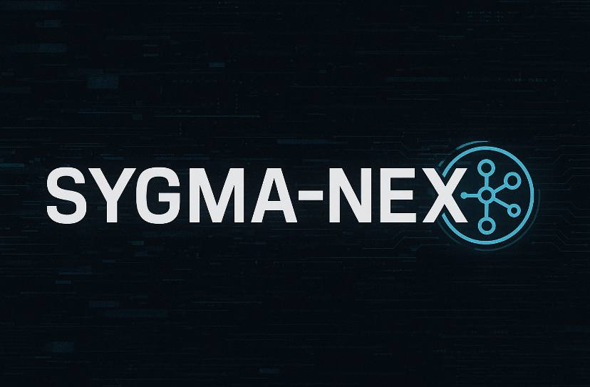

<div align="center">



# DOCUMENTATION INDEX

## Overview

Questo file fornisce un indice completo di tutta la documentazione SIGMA-NEX organizzata per categoria e livello di utilizzo.

</div>

## Getting Started (Nuovi Utenti)

| Documento | Descrizione | Priorità |
|-----------|-------------|----------|
| [README principale](../README.md) | Panoramica completa e punto di partenza | Alta |
| [Installation Guide](installation.md) | Installazione dettagliata per tutti i sistemi | Alta |
| [CLI Guide](guides/cli-guide.md) | Guida completa all'interfaccia a riga di comando | Alta |
| [GUI Guide](guides/gui-guide.md) | Guida all'interfaccia grafica | Alta |

## Configuration & Setup

| Documento | Descrizione | Quando Usare |
|-----------|-------------|--------------|
| [Configuration Guide](guides/configuration.md) | Configurazione base del sistema | Dopo installazione |
| [Configuration Reference](config/config.md) | Reference completa di tutte le opzioni | Per configurazioni avanzate |
| [Security Configuration](config/security.md) | Configurazione sicurezza e compliance | Per ambienti produzione |

## API & Integration

| Documento | Descrizione | Target |
|-----------|-------------|---------|
| [API Usage Guide](guides/api-usage.md) | Guida completa all'utilizzo delle API REST | Sviluppatori |
| [API Reference Base](api.md) | Documentazione endpoint base | Sviluppatori |
| [Runner API](api/runner.md) | Core engine di elaborazione | Sviluppatori avanzati |
| [Context API](api/context.md) | Gestione contesto e prompt | Sviluppatori avanzati |
| [Retriever API](api/retriever.md) | Sistema di ricerca semantica | Sviluppatori avanzati |
| [Translation API](api/translation.md) | Servizi di traduzione | Sviluppatori avanzati |
| [CLI Reference](api/cli.md) | Reference completa comandi CLI | Utenti avanzati |

## Development & Architecture

| Documento | Descrizione | Target |
|-----------|-------------|---------|
| [Development Guide](development.md) | Setup ambiente di sviluppo | Sviluppatori |
| [Architecture Overview](architecture/overview.md) | Architettura del sistema | Architetti/Sviluppatori |
| [Deployment Guide](deployment.md) | Deploy in produzione | DevOps |

## Testing & Quality

| Documento | Descrizione | Target |
|-----------|-------------|---------|
| [Testing Guide](testing.md) | Framework di testing completo | Sviluppatori/QA |

## Troubleshooting & Support

| Documento | Descrizione | Quando Usare |
|-----------|-------------|--------------|
| [Troubleshooting Guide](guides/troubleshooting.md) | Risoluzione problemi comuni | Quando qualcosa non funziona |

## Usage by Role

### End Users
**Percorso consigliato:**
1. [README principale](../README.md) - Panoramica
2. [Installation Guide](installation.md) - Installazione
3. [GUI Guide](guides/gui-guide.md) - Utilizzo interfaccia grafica
4. [Troubleshooting Guide](guides/troubleshooting.md) - In caso di problemi

### Power Users (Amministratori IT)
**Percorso consigliato:**
1. [README principale](../README.md) - Panoramica
2. [Installation Guide](installation.md) - Installazione
3. [CLI Guide](guides/cli-guide.md) - Interfaccia command line
4. [Configuration Guide](guides/configuration.md) - Configurazione sistema
5. [Deployment Guide](deployment.md) - Deploy produzione

### Developers (Sviluppatori)
**Percorso consigliato:**
1. [README principale](../README.md) - Panoramica
2. [Development Guide](development.md) - Setup sviluppo
3. [Architecture Overview](architecture/overview.md) - Architettura
4. [API Usage Guide](guides/api-usage.md) - Utilizzo API
5. [API Reference](api/) - Documentazione API dettagliata
6. [Testing Guide](testing.md) - Testing

### Security Admins (Amministratori Sicurezza)
**Percorso consigliato:**
1. [README principale](../README.md) - Panoramica
2. [Security Configuration](config/security.md) - Configurazione sicurezza
3. [Configuration Reference](config/config.md) - Configurazioni avanzate
4. [Deployment Guide](deployment.md) - Deploy sicuro

### DevOps Engineers
**Percorso consigliato:**
1. [README principale](../README.md) - Panoramica
2. [Deployment Guide](deployment.md) - Deploy e orchestrazione
3. [Configuration Reference](config/config.md) - Configurazioni
4. [Troubleshooting Guide](guides/troubleshooting.md) - Risoluzione problemi

## Learning Path

### Beginner Path (0-2 settimane)
1. Leggi [README principale](../README.md)
2. Installa seguendo [Installation Guide](installation.md)
3. Prova l'interfaccia con [GUI Guide](guides/gui-guide.md)
4. Esplora la CLI con [CLI Guide](guides/cli-guide.md)

### Intermediate Path (2-4 settimane)
1. Configura il sistema con [Configuration Guide](guides/configuration.md)
2. Esplora le API con [API Usage Guide](guides/api-usage.md)
3. Implementa integrazioni personalizzate
4. Studia l'architettura [Architecture Overview](architecture/overview.md)

### Advanced Path (1-2 mesi)
1. Setup ambiente sviluppo [Development Guide](development.md)
2. Contribuisci al progetto
3. Deploy in produzione [Deployment Guide](deployment.md)
4. Implementa funzionalità avanzate

## Quick Reference

### Comandi Rapidi
```bash
# Avvio rapido
sigma self-check              # Verifica sistema
sigma                         # Modalità interattiva
sigma server                  # Avvia API server
sigma gui                     # Interfaccia grafica

# Configurazione
sigma config show            # Mostra configurazione
sigma config validate        # Valida configurazione
sigma config edit           # Modifica configurazione

# Debugging
sigma status --detailed      # Status dettagliato
sigma logs tail             # Logs in tempo reale
sigma diagnose              # Diagnostica completa
```

### Link Rapidi
- **GitHub**: https://github.com/SebastianMartinNS/SYGMA-NEX
- **Issues**: https://github.com/SebastianMartinNS/SYGMA-NEX/issues
- **Discussions**: https://github.com/SebastianMartinNS/SYGMA-NEX/discussions
- **Releases**: https://github.com/SebastianMartinNS/SYGMA-NEX/releases

### Supporto
- **General Support**: rootedlab6@gmail.com
- **Technical Issues**: rootedlab6@gmail.com
- **Security Issues**: rootedlab6@gmail.com
- **Medical Queries**: rootedlab6@gmail.com

## Document Status

| Documento | Status | Ultimo Aggiornamento | Versione |
|-----------|--------|---------------------|----------|
| [README principale](../README.md) | Complete | 2025-09-24 | 0.3.1 |
| [Installation Guide](installation.md) | Complete | 2025-09-24 | 0.3.1 |
| [Development Guide](development.md) | Complete | 2025-09-24 | 0.3.1 |
| [Deployment Guide](deployment.md) | Complete | 2025-09-24 | 0.3.1 |
| [Testing Guide](testing.md) | Complete | 2025-09-24 | 0.3.1 |
| [CI/CD System](ci-cd-system.md) | Complete | 2025-09-25 | 0.3.1 |
| [API Reference](api.md) | Complete | 2025-09-24 | 0.3.1 |

---

**Nota**: Questa documentazione è mantenuta attivamente. Per segnalazioni di errori o suggerimenti di miglioramento, apri una issue su GitHub o contatta il team di documentazione.