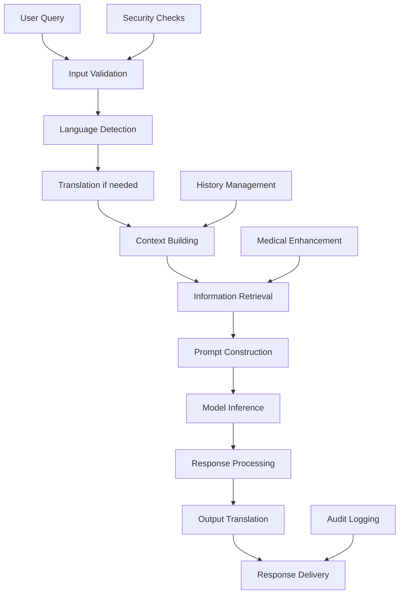
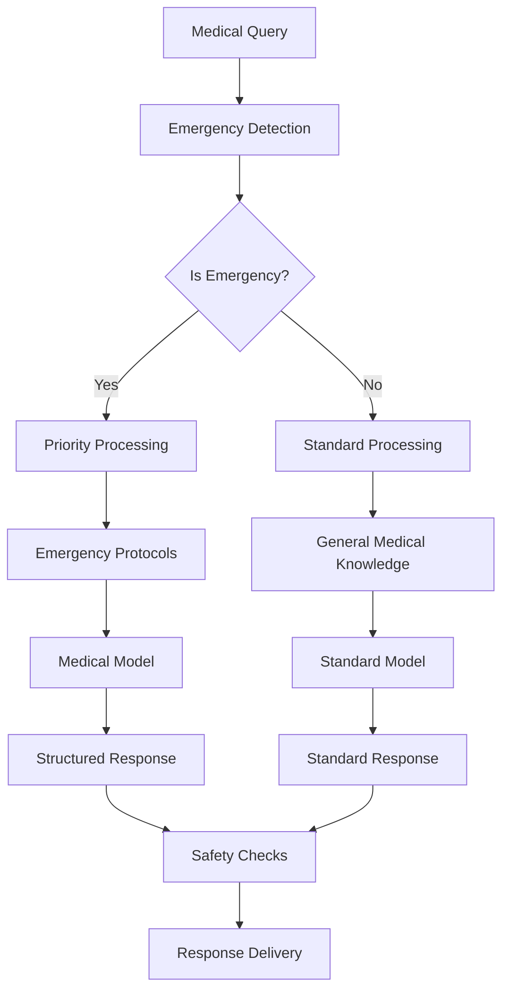

# 🏗️ SIGMA-NEX Architecture Overview

## System Architecture

SIGMA-NEX is designed as a modular, offline-first AI system with a layered architecture that prioritizes reliability, security, and performance.

## High-Level Architecture

```
┌─────────────────────────────────────────────────────────────┐
│                     USER INTERFACES                         │
├─────────────────────────────────────────────────────────────┤
│  ┌─────────────┐  ┌─────────────┐  ┌─────────────┐         │
│  │    CLI      │  │    GUI      │  │   REST API  │         │
│  │ Interface   │  │(CustomTkinter│  │  (FastAPI)  │         │
│  │  (Click)    │  │   Modern)    │  │   Server    │         │
│  └─────────────┘  └─────────────┘  └─────────────┘         │
├─────────────────────────────────────────────────────────────┤
│                    APPLICATION LAYER                        │
├─────────────────────────────────────────────────────────────┤
│  ┌─────────────────────────────────────────────────────┐   │
│  │               CORE ENGINE                          │   │
│  │  ┌─────────┐  ┌─────────┐  ┌─────────┐  ┌─────────┐ │   │
│  │  │ Runner  │  │Context  │  │Retriever│  │Translate│ │   │
│  │  │Manager  │  │Builder  │  │ Engine  │  │ Service │ │   │
│  │  └─────────┘  └─────────┘  └─────────┘  └─────────┘ │   │
│  └─────────────────────────────────────────────────────┘   │
├─────────────────────────────────────────────────────────────┤
│                    INFRASTRUCTURE LAYER                     │
├─────────────────────────────────────────────────────────────┤
│  ┌─────────────────────────────────────────────────────┐   │
│  │             AI MODELS & DATA                        │   │
│  │  ┌─────────┐  ┌─────────┐  ┌─────────┐  ┌─────────┐ │   │
│  │  │ Ollama  │  │ FAISS   │  │MarianMT │  │Medical  │ │   │
│  │  │(Mistral)│  │ Index   │  │ Models  │  │Database │ │   │
│  │  └─────────┘  └─────────┘  └─────────┘  └─────────┘ │   │
│  └─────────────────────────────────────────────────────┘   │
├─────────────────────────────────────────────────────────────┤
│                       DATA LAYER                            │
├─────────────────────────────────────────────────────────────┤
│  ┌─────────────────────────────────────────────────────┐   │
│  │           STORAGE & PERSISTENCE                    │   │
│  │  ┌─────────┐  ┌─────────┐  ┌─────────┐  ┌─────────┐ │   │
│  │  │  File   │  │ Vector  │  │  Cache  │  │  Logs   │ │   │
│  │  │ System  │  │Database │  │ System  │  │ & Audit │ │   │
│  │  └─────────┘  └─────────┘  └─────────┘  └─────────┘ │   │
│  └─────────────────────────────────────────────────────┘   │
└─────────────────────────────────────────────────────────────┘
```

## Core Components

### 1. Runner Engine (`sigma_nex.core.runner`)

**Responsibility**: Orchestrates the entire query processing pipeline

**Key Features**:
- Query lifecycle management
- Model interaction coordination
- Error handling and recovery
- Performance monitoring
- Self-healing capabilities

**Flow**:
```python
Query → Context Building → Model Interaction → Response Processing → Output
```

**Integration Points**:
- Context Builder for prompt construction
- Retriever for information enhancement
- Translator for multilingual support
- Model interface (Ollama)

### 2. Context Builder (`sigma_nex.core.context`)

**Responsibility**: Manages conversation context and prompt engineering

**Key Features**:
- Dynamic prompt construction
- History management
- System prompt selection
- Context optimization
- Memory management

**Components**:
- **Prompt Templates**: Modular, medical-aware templates
- **History Manager**: Intelligent conversation truncation
- **Context Optimizer**: Token-aware context building

### 3. Retriever Engine (`sigma_nex.core.retriever`)

**Responsibility**: Semantic search and information retrieval

**Key Features**:
- FAISS-based vector search
- Document preprocessing
- Relevance scoring
- Medical content prioritization
- Multilingual support

**Architecture**:
```
Query → Embedding → Vector Search → Scoring → Ranking → Results
```

### 4. Translation Service (`sigma_nex.core.translate`)

**Responsibility**: Multilingual support and medical terminology preservation

**Key Features**:
- MarianMT model integration
- Medical term preservation
- Language auto-detection
- Quality assurance
- Cached translations

## Data Flow Architecture

### Query Processing Pipeline



### Medical Emergency Flow



## Security Architecture

### Multi-Layer Security

```
┌─────────────────────────────────────┐
│           APPLICATION SECURITY      │
├─────────────────────────────────────┤
│ • Input Validation & Sanitization  │
│ • Output Filtering                  │
│ • Rate Limiting                     │
│ • Authentication (planned)          │
└─────────────────────────────────────┘
┌─────────────────────────────────────┐
│           DATA SECURITY             │
├─────────────────────────────────────┤
│ • Encryption at Rest               │
│ • Secure Memory Handling           │
│ • Audit Logging                    │
│ • Data Anonymization               │
└─────────────────────────────────────┘
┌─────────────────────────────────────┐
│         INFRASTRUCTURE SECURITY     │
├─────────────────────────────────────┤
│ • Network Isolation                │
│ • Container Security                │
│ • File System Permissions          │
│ • Process Isolation                 │
└─────────────────────────────────────┘
```

### Security Components

1. **Input Validation**: SQL injection, XSS, path traversal protection
2. **Encryption**: AES-256-GCM for sensitive data
3. **Audit System**: Comprehensive logging with anonymization
4. **Access Control**: IP-based filtering, role-based permissions (planned)

## Design Patterns

### 1. Plugin Architecture

SIGMA-NEX uses a plugin-based architecture for extensibility:

```python
class PluginBase:
    def initialize(self, config: dict) -> None: ...
    def process(self, data: Any) -> Any: ...
    def cleanup(self) -> None: ...

class MedicalPlugin(PluginBase):
    def process(self, query: str) -> str:
        # Medical-specific processing
        return enhanced_query
```

### 2. Strategy Pattern

Different processing strategies for different contexts:

```python
class ProcessingStrategy:
    def process_query(self, query: str, context: dict) -> str: ...

class MedicalStrategy(ProcessingStrategy): ...
class GeneralStrategy(ProcessingStrategy): ...
class EmergencyStrategy(ProcessingStrategy): ...
```

### 3. Observer Pattern

Event-driven architecture for monitoring and logging:

```python
class EventManager:
    def subscribe(self, event_type: str, handler: callable): ...
    def emit(self, event_type: str, data: dict): ...

# Usage
event_manager.subscribe('query_processed', audit_logger.log)
event_manager.subscribe('error_occurred', alert_system.notify)
```

### 4. Factory Pattern

Dynamic component creation based on configuration:

```python
class ComponentFactory:
    @staticmethod
    def create_retriever(config: dict) -> Retriever:
        retriever_type = config.get('retrieval.engine', 'faiss')
        if retriever_type == 'faiss':
            return FAISSRetriever(config)
        elif retriever_type == 'elasticsearch':
            return ElasticRetriever(config)
```

## Performance Architecture

### Caching Strategy

```
┌─────────────────────────────────────┐
│            L1 CACHE                 │
│         (In-Memory)                 │
├─────────────────────────────────────┤
│ • Recent queries                    │
│ • Model responses                   │
│ • Embeddings                        │
│ • Translations                      │
└─────────────────────────────────────┘
┌─────────────────────────────────────┐
│            L2 CACHE                 │
│         (Redis/File)                │
├─────────────────────────────────────┤
│ • Processed documents               │
│ • Vector indices                    │
│ • Model artifacts                   │
│ • Configuration cache               │
└─────────────────────────────────────┘
```

### Optimization Techniques

1. **Lazy Loading**: Components loaded on-demand
2. **Connection Pooling**: Efficient resource management
3. **Batch Processing**: Bulk operations for efficiency
4. **Streaming**: Real-time response streaming
5. **Compression**: Data compression for storage/transfer

## Scalability Architecture

### Horizontal Scaling

```
┌─────────────────────────────────────┐
│           LOAD BALANCER             │
└─────────────────┬───────────────────┘
                  │
    ┌─────────────┼─────────────┐
    │             │             │
┌───▼───┐     ┌───▼───┐     ┌───▼───┐
│ API   │     │ API   │     │ API   │
│Server │     │Server │     │Server │
│   1   │     │   2   │     │   3   │
└───────┘     └───────┘     └───────┘
    │             │             │
    └─────────────┼─────────────┘
                  │
┌─────────────────▼───────────────────┐
│          SHARED STORAGE             │
│   • Vector Database                 │
│   • Model Cache                     │
│   • Configuration                   │
└─────────────────────────────────────┘
```

### Vertical Scaling

- **Multi-threading**: Concurrent request processing
- **Async I/O**: Non-blocking operations
- **Resource pooling**: Efficient resource utilization
- **Memory optimization**: Smart memory management

## Technology Stack

### Core Technologies

| Layer | Technology | Purpose |
|-------|------------|---------|
| **AI Models** | Ollama, MarianMT | Model inference |
| **Search** | FAISS | Vector similarity search |
| **Web Framework** | FastAPI | REST API server |
| **GUI Framework** | CustomTkinter | Modern desktop UI |
| **CLI Framework** | Click | Command-line interface |
| **Configuration** | PyYAML | Config management |
| **Logging** | Python logging | System monitoring |

### Infrastructure

| Component | Technology | Purpose |
|-----------|------------|---------|
| **Containerization** | Docker | Deployment packaging |
| **Orchestration** | Docker Compose | Multi-container management |
| **Monitoring** | Prometheus | Metrics collection |
| **Security** | cryptography | Data encryption |
| **Testing** | pytest | Quality assurance |

## Integration Points

### External Services

1. **Ollama**: Primary AI model inference
2. **HuggingFace**: Model downloads and updates
3. **Medical Databases**: External medical knowledge
4. **Translation APIs**: Fallback translation services

### Internal APIs

1. **Core API**: Internal component communication
2. **Plugin API**: Extension mechanism
3. **Configuration API**: Dynamic configuration
4. **Monitoring API**: Health and metrics

## Future Architecture Considerations

### Planned Enhancements

1. **Microservices**: Service decomposition for better scalability
2. **Message Queue**: Asynchronous processing with Redis/RabbitMQ
3. **Database Integration**: PostgreSQL for structured data
4. **Authentication**: OAuth2/JWT implementation
5. **Distributed Cache**: Redis cluster for shared caching
6. **Container Orchestration**: Kubernetes support

### Cloud-Ready Design

- **12-Factor App**: Cloud-native principles
- **Health Checks**: Kubernetes-compatible health endpoints
- **Configuration**: Environment-based configuration
- **Logging**: Structured logging for aggregation
- **Metrics**: Prometheus-compatible metrics

---

This architecture ensures SIGMA-NEX is:
- **Scalable**: Handles growing workloads
- **Reliable**: Fault-tolerant and self-healing
- **Secure**: Multi-layer security approach
- **Maintainable**: Clean, modular design
- **Extensible**: Plugin-based architecture
